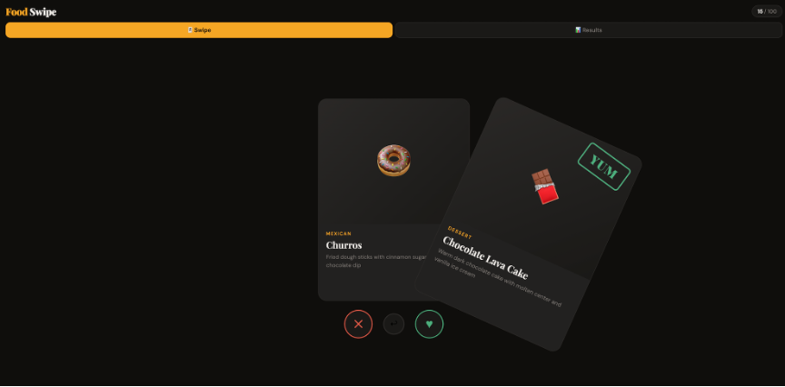
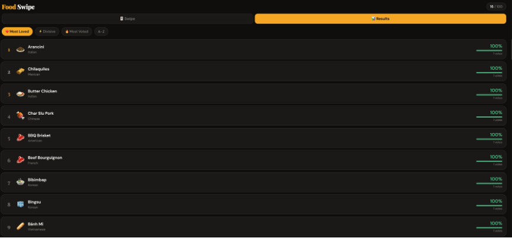

# 🍽️ FoodSwipe

A mobile-first swipe-to-vote web app for rating world cuisines. Swipe right to love a dish, left to skip it — see how your taste compares to everyone else.

---

## How to Run

### 1. Backend (Python/Flask)

```bash
cd backend
pip install flask flask-cors
python seed.py        # seeds 100 food items into votes.db
python server.py      # starts API on http://localhost:3001
```

### 2. Frontend

Open `frontend/index.html` in your browser, **or** serve it:

```bash
cd frontend
python3 -m http.server 8080
# visit http://localhost:8080
```

> For mobile testing: find your machine's local IP (`ifconfig` / `ipconfig`), open `http://YOUR_IP:8080` on your phone (must be on the same WiFi). Update the `API` constant in `index.html` to match.

---

## UI

### Swipe Left/Right



### Result



## Architecture

**Frontend:** Single HTML file with vanilla JS and CSS.
Touch drag gestures are implemented from scratch using `touchstart`/`touchmove`/`touchend` events.
Session ID is generated client-side and stored in `localStorage` as a UX cache.

**Backend:** Python Flask REST API with SQLite via the built-in `sqlite3` module. Three endpoints: `GET /items`, `POST /vote`, `GET /results`. The `votes` table has a `UNIQUE(item_id, session_id)` constraint enforced at the DB level — an `INSERT OR REPLACE` (upsert) handles idempotency, so double-voting updates rather than duplicates.
SQLite was chosen for zero-config simplicity; swapping to Postgres requires only changing the connection string.

---

## Requirements Completed

### Core (Section 3.1)

- [x] 100 distinct food items across 15+ world cuisines
- [x] Swipe right = Yes, swipe left = No
- [x] Visual feedback: card tilt, YUM/NOPE overlays, color thresholds
- [x] Smooth card transition animation
- [x] Results view with aggregate yes/no counts across all users
- [x] Four sort modes: Most Loved, Divisive, Most Voted, A–Z
- [x] All votes persisted to Flask/SQLite backend
- [x] End-of-deck state with CTA to results

### Stretch (Section 3.2)

- [x] Anonymous session ID persisted across reloads (localStorage cache → server truth)
- [x] Undo last swipe (stretch #8)
- [ ] Real-time updates — not implemented (would add polling every 30s)
- [ ] Admin seed script via web UI — seed.py covers CLI seeding

---

## Known Issues

- Images use Unsplash Source URLs which may load slowly or return random food photos; in production, curated image URLs per item would be preferable.
- No HTTPS — backend must be on localhost or same-origin for production use.
- Undo does not re-POST a correction to the server (the previous vote persists); it only removes the item from the client's "voted" set so it reappears in the deck.

---

## Trade-offs Made Under Time Pressure

| Decision           | Choice                        | Rationale                                        |
| ------------------ | ----------------------------- | ------------------------------------------------ |
| Frontend framework | Vanilla JS                    | No build tooling; fastest to iterate             |
| Backend language   | Python/Flask                  | No native compilation issues vs Node/SQLite      |
| Database           | SQLite                        | Zero setup; single file                          |
| Images             | Unsplash Source               | Avoids licensing issues; no image hosting needed |
| Dedup strategy     | DB UNIQUE constraint + upsert | Atomic, race-condition-safe                      |
